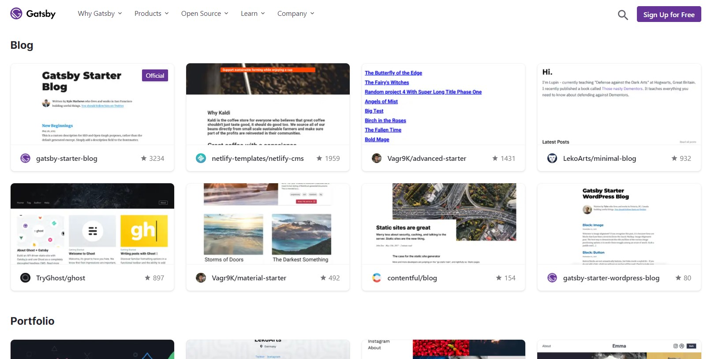
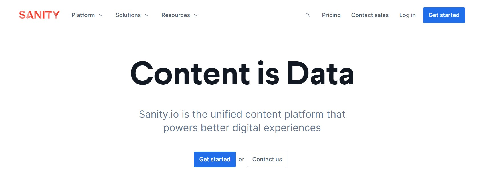
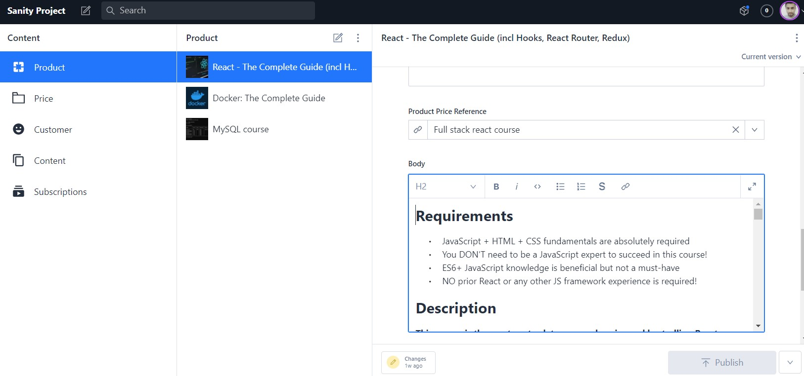
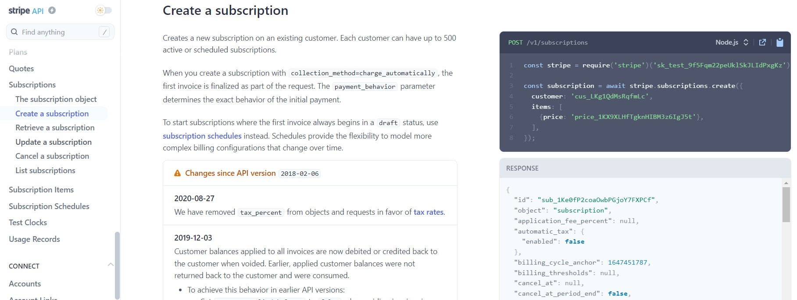

There are many online platforms for selling courses online, however, I found a few limitations. For the course platform, I would like more customization of landing pages, subscriptions, and content structure. Therefore, I created my own platform for selling courses myself.

Here, I'll briefly describe how I built a platform for selling my course. We used Gatsby Framework, Sanity_io, and Stripe to build the website.

Gatsby is a framework built on React. We use the Gatsby Framework to build the frontend and backend. The benefits of using the Gatsby framework are as follows:

1. It supports thousands of plugins that we can use in the project.
2. We can fetch the data both at build and runtime.
3. Run serverless function.

To get started with the Gatsby Framework, you can choose the starter template from the below page.

https://www.gatsbyjs.com/starters

The starter template is the reference point. You can customize the starter template as per your need. For the project, we used Tailwind CSS to style the HTML elements. Tailwind CSS provides utility classes that we can use in the project. Take a look at the image below to see how tailwind works.

You can also find tons of Tailwind CSS components online that you can use in your project. Some of the example websites are listed below.

- https://tailwindcomponents.com
- https://flowbite.com
- https://www.wickedtemplates.com

In order to make the website available on the internet, we host the project on Github and deploy the repo on Netlify. Netlify provides a better user experience to build, deploy, and scale production applications.

Gatsby is a framework, not a database. So, we need a database to store and manage the content data. I use Sanity_io for that purpose. You can see the official Sanity page below.

https://www.sanity.io

Sanity_io has two layers as below.

1. Sanity Studio
2. Sanity Server

The Sanity Server is a database, fully managed by the Sanity team so we don't need to worry about that. Sanity has a pricing model that charges for data usage.

Sanity Studio is a CMS that allows us to fully customize the document's schema. In our case, we can create different documents in Sanity Studio e.g. course, customer, subscription, etc. For each document, we can define custom schema as per the requirements.

Stripe is the platform we use to process online payments. To collect payments from users, we need to build a checkout page. In Stripe, we have multiple options to create checkout. Below are two approaches to creating Stripe checkout:

1. Stripe built-in checkout (fully managed by Stripe team).
2. Create custom checkout using the Stripe API.

Stripe's built-in checkout is easier to use since we can have fewer bugs and more payment solutions out of the box.

## How to interconnect different layers of service?

The data is stored in Sanity Studio, the frontend UI is built on Gatsby Framework, and recipient subscription details are available on the Stripe server. As described, we have three layers of services. We want the data to be available to the user in the Gatsby project. To glue the data layers, we can use the API.

By using the Stripe Node API, we can retrieve and modify the recipient subscription. In the Gatsby framework, we use serverless functions to execute the Stripe Node API calls. You can find the Stripe Node API on the below page.

- https://stripe.com/docs/api?lang=node

To get the Sanity data in the frontend, we can send the HTTP requests to the respective API route. We can use the Sanity GROQ language to get the desired data from the Sanity server. You can learn more about Sanity GROQ language on the following page.

- https://www.sanity.io/docs/groq

## Final words

Here, I discuss briefly how I built my course platform website. If you want to learn more, you can check the below course.

- [Build A Standout Website](https://taimoorsattar.dev/p/build-standout-website)
