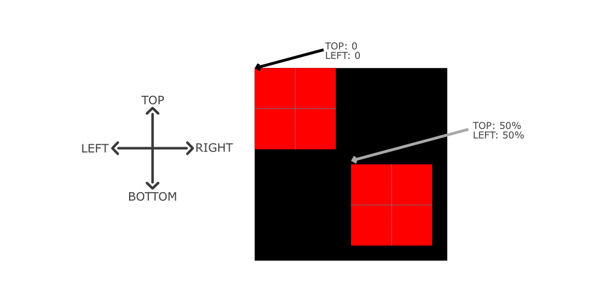

Absolute and relative positioning are both used to position HTML elements in relation to a reference point. Recently, I used [absolute and relative position to align the search icon in the HTML input](https://taimoorsattar.dev/blogs/style-html-form-with-css).

Let's work on an example to understand CSS positions (absolute and relative). For this example, we place the small box on the top of the large box. The full source code is available in the following codepen link.

- https://codepen.io/taimoorsattar/pen/dyMNPYz

In the HTML, we can define the box as below in the code:

```html
<div class="outside">
  <div class="inside"></div>
</div>
```

To style the above HTML element, we can paste the below CSS code:

```css
.outside {
  margin: auto;
  display: block;
  width: 500px;
  height: 500px;
  background-color: black;
}

.inside {
  display: block;
  width: 200px;
  height: 200px;
  background-color: red;
}
```

If you now visit the browser, the following page is rendered:


We want to update the position of the small box with reference to the big box. Therefore, we can mention `position: relative` in the `.outside` class and `position: absolute` in the `.inside` class as follows:

```css
.outside {
  position: relative;
  /*  ++ CSS styles;  */
}
.inside {
  position: absolute;
  /*  ++ CSS styles;  */
}
```

We want to adjust the position of the small box so that I align in the center of the big box. For that, we can adjust the `top` and `left` values as shown in the below image.



As shown in the above image, `top: 50%` and `left: 50%` do not align the box in the center so we can use the `transform: translate(-50%, -50%)` property to align the small box in the center as shown in below image.


Finally, we can write the `.inside` class as below:

```css
.inside {
  display: block;
  position: absolute;
  width: 200px;
  height: 200px;
  top: 50%;
  left: 50%;
  background-color: red;
  transform: translate(-50%, -50%);
}
```
