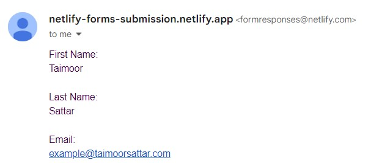

In this blog, we'll learn how to submit the form programmatically using Puppeteer and 2Captcha. I'll be working on my previous [Netlify form example](https://taimoorsattar.com/blogs/form-submission-with-netlify-forms).

You can preview the form on [this page](https://netlify-forms-submission.netlify.app).

The full source code of the form submission using Puppeteer and 2Captcha is found in [this repo](https://github.com/taimoorsattar7/puppeteer-captcha).

## Get Started

To Get Started, we need to create a new folder and execute the below command at the root of the folder.

```
npm init
```

The above command will walk you through creating a `package.json` file. After that, we need to install a few dependencies for the project as listed below.

- `axios`
- `dotenv`
- `puppeteer`

To install the above dependencies, run the following command in the terminal.

```
npm i axios dotenv puppeteer
```

To write the code, we need to create a file, `index.js` at the root of the folder. Below, we describe how we'll implement the form submission logic in the index.js file:

- Navigate to the Form submission page using Puppeteer
- Fill out the required input fields
- Query the Recaptcha googlekey from the DOM
- Send googlekey to 2captcha solver
- Wait until the Recaptcha is solved and then update the DOM with the result.
- After that submit the form

In `index.js`, import the required dependencies as below.

```js
require("dotenv").config()

const axios = require("axios")
const puppeteer = require("puppeteer")
```

To use the 2Captcha in the code, We need the API key secret variable. We can get the API key from the 2Captcha dashboard. You can learn more about [2Captcha in this blog](/blogs/solve-captcha-with-2captcha).

In the root of the folder, create a `.env` file and paste the API key as follows:

```
key=50d166d2f9839005067458bb3810deec7
```

In the `index.js`, we need to wrap the code in async functions, as we will wait for certain actions to complete.

```
(async () => {
  // Code here...
})()
```

In the async function, we can write the code below to navigate to the specific page:

```js
let pageurl = "https://netlify-forms-submission.netlify.app/"
let browser = await puppeteer.launch({ headless: true })
let page = await browser.newPage()
await page.goto(pageurl)
```

In the next step, we need to fill the required input fields using Puppeteer as follows:

```js
await page.type("[name=firstName]", "Taimoor")
await page.type("[name=lastName]", "Sattar")
await page.type("[name=email]", "example@gmail.com")
await page.type("[name=url]", "https://taimoorsattar.com")
await page.type("[name=message]", "Hi there")
await page.type("[name=positions]", "frontEnd")
```

To submit the form, we have to verify the captcha. For that, we need to retrieve the Recaptcha sitekey from the DOM and verify it using the 2captcha service as below. For that, we can write the code as below.

```js
const googlekey = await page.$eval(".g-recaptcha", el => el.dataset.sitekey)

let captchaSolver = await axios.get(
  `http://2captcha.com/in.php?key=${process.env.key}&method=userrecaptcha&pageurl=${pageurl}&googlekey=${googlekey}&json=1`
)
```

We'll wait until Recaptcha is solved. For that, we'll define a promise that resolves when the Recaptcha is solved and returns the token as below.

```js
await page.waitForTimeout(1000)

const TOKEN = await new Promise((resolve, reject) => {
  let intervalID = setInterval(async () => {
    let captchaResult = await axios.get(
      `http://2captcha.com/res.php?key=${process.env.key}&action=get&id=${captchaSolver?.data?.request}&json=1`
    )
    console.log(captchaResult?.data)

    if (captchaResult?.data?.status == 1) {
      clearInterval(intervalID)
      resolve(captchaResult?.data?.request)
    }
  }, 8300)
})
```

You can learn more about [promise in Javascript here](https://taimoorsattar.com/blogs/promise-in-javascript).

After we recieve the token from the 2Captcha, we need to update the DOM with the token as below.

```js
let siteToken = await page.evaluate(TOKEN => {
  let result = (document.getElementById("g-recaptcha-response").innerHTML =
    TOKEN)
  let exp = document.getElementById("g-recaptcha-response").innerHTML

  return exp
}, TOKEN)
```

Before submitting the form, we need to take a screenshot of the form page to see what the final submission looks like. For that, we can write the code as below:

```js
await page.screenshot({
  type: "jpeg",
  path: "buddy-screenshot.png",
  fullPage: true,
})
```

Finally, we'll submit the form and close the browser. To do this, we write the code below.

```js
await page.click("[type=submit]")

await browser.close()
```

To test the code, we can execute the below command in the terminal

```
node index
```

After the above command is successfully executed, form is submitted and receive a message in the inbox for form submission.


