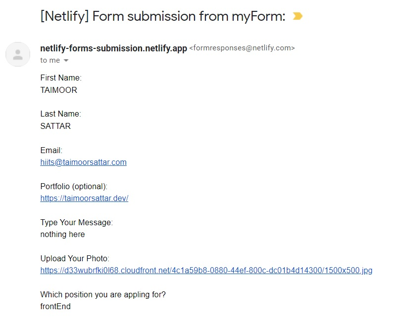

 

Netlify forms allow you to manage forms and submissions without writing any server-side code or JavaScript. As soon as the form is deployed on the Netlify server, submissions will appear in your Netlify dashboard. It also notifies us about the form submission via email, outgoing webhooks, slack channel, etc. To learn more about Netlify forms, you can visit [this page](https://www.netlify.com/products/forms).

The alternative of Netlify Forms is as below.

- [getform.io](https://getform.io)
- [formspree.io](https://formspree.io)


You can view the full source code of the example covered here at the below link.
- [taimoorsattar7/html-form-netlify](https://github.com/taimoorsattar7/html-form-netlify)

## Get started

We need to first create an HTML form that is used to submit the job application.


As we discussed in detail [on this page](https://taimoorsattar.com/blogs/create-html-form) how to create an HTML form, we are now going to discuss how to submit the form using Netlify.

In order to make HTML forms work on Netlify, we can add additional attributes and elements. For example in the `form` element, we can add the following attributes:

```html
<form onsubmit="return handleSubmit(event)"
 method="POST"
 data-netlify="true"

 data-netlify-recaptcha="true"
 netlify-honeypot="bot-field"
>
```

Now, let's explain about the 

- <b>`onsubmit` Function</b>: When the form is submitted, it executes a function that validates the input and submits the form if the input is valid.
- <b>`method="POST"`</b>: POST method is used to send data to a server to create/update a resource.
- `data-netlify="true"`: Start receiving submissions in your Netlify site admin panel by adding the respective attribute.
- `data-netlify-recaptcha="true"`: It rejects submissions if the challenges is not passed. 
- `netlify-honeypot="bot-field"`: It is hidden input field that trick bot users into completing a field that human users cannot see.


For that `netlify-honeypot` and `data-netlify-recaptcha` attribute, we need to add an extra code into the HTML element.

For the `netlify-honeypot`, we can add the below line of code to add hidden input elements into the HTML form. 

```html
<p class="hidden">
 <label>Don't fill this out if you're human: <input name="bot-field" /></label>
</p>
```

HTML input like the one above is hidden from human eyes. Nonetheless, if the bot is filling out the form, it can be counted as spam because it fills in the hidden input. 

For the `netlify-honeypot` attribute, we can add the below line of code in the HTML form.

```html
<div data-netlify-recaptcha="true"></div>
```

The about code


You can learn more about the Netlify spam filter on [this page](https://docs.netlify.com/forms/spam-filters).

## Testing the form on Netlify

To test the form submission, we first need to deploy the code on Netlify. You can learn more about it on [this page](https://taimoorsattar.com/modules/build-a-standout-website/hosting-on-netlify). 
 

After you deploy the code, we need to test the HTML form. To test the form, we need to fill in the input and submit the form as shown below:


As shown above, the Netlify admin panel receives the form submission data. To notify submissions to email, we have to configure email notification on the Netlify dashboard as shown below.


As soon as you set up email notification for the form submission in Netlify Dashboard, you will receive an email containing the following information:


