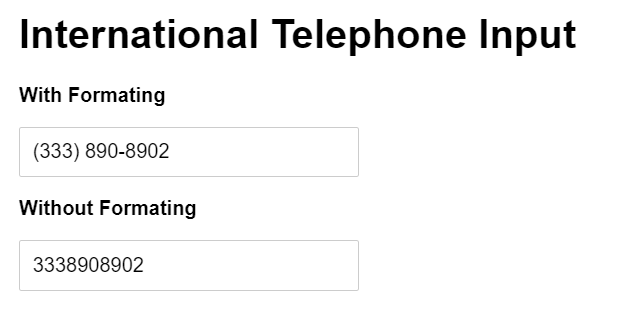
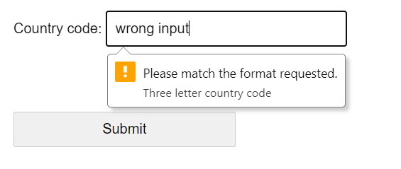
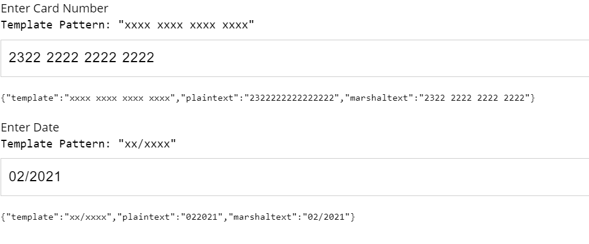

In HTML, the input element is used to take the user's input. The user's input could be of any type e.g. bank account, decimal digits, phone number, etc. In the below image, the formatted input text gives the user more meaning.



To improve the user experience and reduce errors, we need to format the user's input in real-time while typing.

The simple solution is to use the pattern attribute in HTML to check the user input. For that we can [create HTML form](https://taimoorsattar.com/blogs/create-html-form) and define the regex expression for the pattern attribute as shown below:

```html
<form>
  <label for="country_code">Country code:</label>
  <input
    type="text"
    id="country_code"
    name="country_code"
    pattern="[A-Za-z]{3}"
    title="Three letter country code"
  /><br /><br />
  <input type="submit" />
</form>
```

In the above code, the user is only notified about the input while submitting the form as shown below.



---

But, we want to format the user's input while typing. For that, we need to define a javascript function executed on input change. So, we define our input field in HTML as below:

```html
<input type="tel" id="phone" name="phone" />
```

Whenever the input is changed, we need to format the plain input text as shown in the below code:

```js
const phone = document.getElementById("phone");

phone.oninput = (e) => {
  e.target.value = autoFormatPhoneNumber(e.target.value);
};
```

We can define the `autoFormatPhoneNumber` function to format the phone number using the regex expression as below:

```js
function autoFormatPhoneNumber(phoneNumberString) {
  try {
    var cleaned = ("" + phoneNumberString).replace(/\D/g, "");
    var match = cleaned.match(/^(1|)?(\d{0,3})?(\d{0,3})?(\d{0,4})?$/);
    var intlCode = match[1] ? "+1 " : "";
    return [
      intlCode,
      match[2] ? "(" : "",
      match[2],
      match[3] ? ") " : "",
      match[3],
      match[4] ? "-" : "",
      match[4],
    ].join("");
  } catch (err) {
    return "";
  }
}

console.log(autoFormatPhoneNumber("+12345678900")); // => "+1 (234) 567-8900"

console.log(autoFormatPhoneNumber("2345678900")); // => "(234) 567-8900"
```

The above code is displayed in the browser as below:


The full code example is found on the below codepen link:

https://codepen.io/taimoorsattar/pen/vYRJExq

---

In the previous example, we used regex to format the phone input text. But... the problem with regex is that we need to define the different regex expressions for different types of input e.g. card number, [date format javascript](https://taimoorsattar.com/blogs/javascript-date-format), etc. Rather than regex expression, we can use a pattern match to format the input text.

To work on the pattern match example, we can define the Card Number input as below:

```html
<label>Card Number</label>
<input
  autocomplete="cc-number"
  id="cardNumber"
  name="cardNumber"
  type="tel"
  placeholder="1234 1234 1234 1234"
/>
```

When the above Card Number input is changed, we need to execute the `patternMatch` to format the card Number input text.

```js
const cardNumber = document.getElementById("cardNumber");

cardNumber.oninput = (e) => {
  e.target.value = patternMatch({
    input: e.target.value,
    template: "xxxx xxxx xxxx xxxx",
  });
};
```

The `patternMatch` function format the text as per the defined pattern. We can define the `patternMatch` function as below:

```js
function patternMatch({ input, template }) {
  try {
    let j = 0;
    let plaintext = "";
    let countj = 0;
    while (j < template.length) {
      if (countj > input.length - 1) {
        template = template.substring(0, j);
        break;
      }

      if (template[j] == input[j]) {
        j++;
        countj++;
        continue;
      }

      if (template[j] == "x") {
        template =
          template.substring(0, j) + input[countj] + template.substring(j + 1);
        plaintext = plaintext + input[countj];
        countj++;
      }
      j++;
    }

    return template;
  } catch {
    return "";
  }
}
```

The above example code renders in the browser as below:


The full code example is found on the below codepen link:

https://codepen.io/taimoorsattar/pen/qBoXdQa

---

We can use an npm package to format the text on the pattern template, [text marshal](https://www.npmjs.com/package/text-marshal). To download the text marshal npm package, we can execute the below command in the terminal.

```sh
npm i text-marshal
```

To define the Card Number input, we can write the below code in HTML:

```html
<label for="cardnumber">Enter Card Number</label>

<input
  class="headline headline__text"
  type="text"
  id="cardnumber"
  name="cardnumber"
  data-pattern="xxxx xxxx xxxx xxxx"
/>
```

To import the text marshal package in the project, we can add the below line of code in Javascript:

```js
import { textMarshal } from "text-marshal";
```

To make the text marshal npm package work, we can write the below code in javascript:

```js
import { textMarshal } from "text-marshal";

const cardnumber = document.getElementById("cardnumber");

cardnumber.oninput = function (e) {
  let data = textMarshal({
    input: e.target.value,
    template: cardnumber.getAttribute("data-pattern"),
    disallowCharacters: [/[a-z]/],
  });

  cardnumber.value = data.marshaltext;
};
```

The above example is displayed in the browser as below.



You can view the complete example code below codesandbox.

https://codesandbox.io/s/text-marshal-npm-package-9zyh5k

In addition, the text marshal npm package has options to disallow characters and define infinite template patterns.

## Final words

We can reduce errors and improve the user experience by formating the input text in real-time. As a developer, we've many options to format the input text while typing. The text Marshal npm package simplifies the task of formatting the text input.
