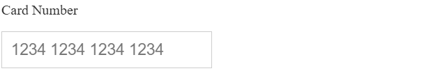

The input element in the HTML is used to take the user's input. The user's input can be of any type e.g. bank account, decimal digits, phone number, etc. The formatted input text gives more meaning to the user.


The simple solution is to use the pattern attribute in HTML to check the user input. For that, we can [create HTML form](https://taimoorsattar.com/blogs/create-html-form) and define the regex expression for the pattern attribute as shown below:

```html
<form onsubmit="alert('The Input is Valid');">
  <label for="phone_no">Phone No:</label>
  <input
    type="tel"
    id="phone_no"
    name="phone_no"
    pattern="\([0-9]{3}\) [0-9]{2}-[0-9]{3}"
    title="Phone Format: (xxx) xx-xxx"
    placeholder="(xxx) xx-xxx"
    required="'required'"
    autocomplete="off"
  />
  <input type="submit" value="Submit" />
</form>
```

In the above code, the user is only notified about the input is valid when clicked the `submit` button.


The full code of the above example can be found in the Codepen link below:

https://codepen.io/taimoorsattar/pen/gOQQbvP

---

In order to improve the user experience and reduce errors, we can format the user's input in real-time **while typing**. Technically, we need to focus on two things while writing code as below.

1. Format the input value as desired
2. Set the correct cursor position 

In this blog, we will cover two (2) code examples to format input value while typing.

## Example #1

In the first example, we will use the regex expression to format the input value. If you want to learn more about regex, you can click [this link](https://taimoorsattar.com/blogs/regex-javascript).

To get started, we can write the code in HTML as below.

```html
<input type="tel"
       id="phone"
       name="phone"
       placeholder="(xxx) xxx-xxxx"
       />
```

Whenever the input value is changed, we need to execute the javascript function that format the input. For that, we can write the javascript code as below.

```js
const phone = document.getElementById("phone")


phone.oninput = (e) => {
  let formatInput = autoFormatPhoneNumber(e.target)
  e.target.value = String(formatInput)
}
```

To format the phone number using the regex expression, We can define the `autoFormatPhoneNumber` function as below:

```js
function autoFormatPhoneNumber(ref) {
  try {
    let phoneNumberString = ref.value
    var cleaned = ("" + phoneNumberString).replace(/\D/g, "");
    var match = cleaned.match(/^(\d{0,3})?(\d{0,3})?(\d{0,4})?/);
    return [match[1] ? "(": "",
            match[1], 
            match[2] ? ") ": "",
            match[2],
            match[3] ? "-": "",
            match[3]].join("")
    
  } catch(err) {
    return "";
  }
}

console.log(autoFormatPhoneNumber("2345678900")); // => "(234) 567-8900"
```

The above code works fine but when the user type the text in between of the input value, the cursor postion goes to the last. This is what we don't want. To fix this, we can add the below lines of code. 

```js
phone.oninput = (e) => {
  let cursorPos = e.target.selectionStart 
  let formatInput = autoFormatPhoneNumber(e.target)
  e.target.value = String(formatInput)
  let isBackspace = (e?.data==null) ? true: false
  let nextCusPos = nextDigit(formatInput, cursorPos, isBackspace)
  
  phone.setSelectionRange(nextCusPos+1, nextCusPos+1);
}
```

In the above code, we use the `nextDigit` function to determine the correct position of the cursor. To define the `nextDigit` function, we can write the code as below in javascript.

```js
function nextDigit(input, cursorpos, isBackspace) {
  if (isBackspace){
    for (let i = cursorpos-1; i > 0; i--) {
    if(/\d/.test(input[i])){
      return i
    }
  }
  }else{
    for (let i = cursorpos-1; i < input.length; i++) {
    if(/\d/.test(input[i])){
      return i
    }
  }
  }
  
  return cursorpos
}
```

The above code is displayed in the browser as below:


The full code example is found on the below codepen link:

https://codepen.io/taimoorsattar/pen/vYRJExq

---

## Example #2

In the previous example, we used regex to format the phone input text. But... the problem with regex is that we need to define the different regex expressions for different types of input e.g. card number, [date format javascript](https://taimoorsattar.com/blogs/javascript-date-format), etc. Rather than regex expression, we can use a pattern match to format the input text.

In this example, we can write the code as below:

```html
<label>Card Number</label>
<input
  autocomplete="cc-number"
  id="cardNumber"
  name="cardNumber"
  type="tel"
  placeholder="1234 1234 1234 1234"
/>
```

To track the input change, we can write the below code in javascript.

```js
const cardNumber = document.getElementById("cardNumber");

cardNumber.oninput = (e) => {
  let cursorPos = e.target.selectionStart
  let currentValue = e.target.value
  let cleanValue = currentValue.replace(/\D/g, "");
  let formatInput = patternMatch({
      input: cleanValue,
      template: "xxxx xxxx xxxx xxxx"
   });
  
  e.target.value = formatInput
  
  let isBackspace = (e?.data==null) ? true: false
  let nextCusPos = nextDigit(formatInput, cursorPos, isBackspace)
  
  cardNumber.setSelectionRange(nextCusPos+1, nextCusPos+1);
};
```

In the above code, we use `nextDigit` from the example #1 to position the cursor. The `patternMatch` function format the text as per the defined pattern. We can define the `patternMatch` function as below:

```js
function patternMatch({ input, template }) {
  try {
    let j = 0;
    let plaintext = "";
    let countj = 0;
    while (j < template.length) {
      if (countj > input.length - 1) {
        template = template.substring(0, j);
        break;
      }

      if (template[j] == input[j]) {
        j++;
        countj++;
        continue;
      }

      if (template[j] == "x") {
        template =
          template.substring(0, j) + input[countj] + template.substring(j + 1);
        plaintext = plaintext + input[countj];
        countj++;
      }
      j++;
    }

    return template;
  } catch {
    return "";
  }
}
```

The above example code renders in the browser as below:



The full code example is found on the below codepen link:

https://codepen.io/taimoorsattar/pen/qBoXdQa

---

We can use an npm package to format the text on the pattern template, [text marshal](https://www.npmjs.com/package/text-marshal). To download the text marshal npm package, we can execute the below command in the terminal.

```sh
npm i text-marshal
```

To define the Card Number input, we can write the below code in HTML:

```html
<label for="cardnumber">Enter Card Number</label>

<input
  class="headline headline__text"
  type="text"
  id="cardnumber"
  name="cardnumber"
  data-pattern="xxxx xxxx xxxx xxxx"
/>
```

To import the text marshal package in the project, we can add the below line of code in Javascript:

```js
import { textMarshal } from "text-marshal";
```

To make the text marshal npm package work, we can write the below code in javascript:

```js
import { textMarshal } from "text-marshal";

const cardnumber = document.getElementById("cardnumber");

cardnumber.oninput = function (e) {
  let data = textMarshal({
    input: e.target.value,
    template: cardnumber.getAttribute("data-pattern"),
    disallowCharacters: [/[a-z]/],
  });

  cardnumber.value = data.marshaltext;
};
```

The above example is displayed in the browser as below.


You can view the complete example code below codesandbox.

https://codesandbox.io/s/text-marshal-npm-package-9zyh5k

In addition, the text marshal npm package has options to disallow characters and define infinite template patterns.

## Final words

We can reduce errors and improve the user experience by formating the input text in real-time. As a developer, we've many options to format the input text while typing. The text Marshal npm package simplifies the task of formatting the text input.
