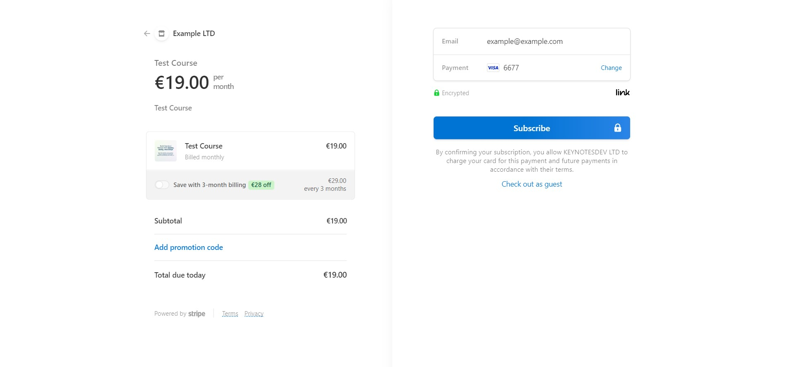

Today, we have many options when it comes to choosing a technology and framework for building a website. In this blog, I'll walk through different technologies and frameworks that I use to build my website.

First of all, this website is [build using Gatsby Framework](https://taimoorsattar.com/modules/build-a-standout-website/gatsby-and-jamstack).

Gatsbyjs is a React-based framework used to build static and dynamic sites. Gatsbyjs framework helps to optimize the site, supports lazy-loading, page routing, automates code-splitting, image optimization, etc.

In Gatsbyjs, I use markdown for the blogs. I use to manage and publish the markdown content using netlify CMS. NetlifyCMS is an open-source content management system for git workflow. We can use NetlifyCMS to manage and publish the content. The blog content is published on the project repository's filesystem. We can then fetch the blog post content from the filesystem and render it on the website blog page. Also, I used to embed code/video into the blog from other website e.g. [Codepen](https://codepen.io), [Youtube](https://www.youtube.com) and [Codesandbox](https://codesandbox.io).

If you would like to contact me for any query, You can visit the [contact page](https://taimoorsattar.com/contact) and submit the contact form. To make the contact form to work, I use SendGrid to send the email. Sendgrid is a cloud-based email delivery platform that delivers transitional and marketing emails. After verifying your details, we sends the user's message to the server.

For my course's platform, I use [Stripe](https://stripe.com) to collect the payment. Stripe is an online popular payment processing platform. As shown below, we can collect payment from the user using the Stripe built-in checkout page.

We can store the recipient credential on the Sanity Server and email it to the recipient after the user completes the payment. The recipient can use the credential to login into the dashboard.

If the recipient wants to access the course content, we first verify that the recipient is actually subscribed. For that, we send an API request to the Sanity server to check if the recipient document exists. The recipient can view the course content if this is the case. We don't want to send an HTTP request every time when the recipient wants to access the content which would be a cost burden on the server. We only want to verify the recipient details once. For that, we need to cache the response of the HTTP request that verifies the recipient details. For that, we can use React query. [React query](https://react-query.tanstack.com) helps to fetch, cache, and update data in your React applications.

I mentioned a few tasks that we perform on certain user interactions above, which are highlighted as follows:

- Login or register into the dashboard
- Send emails to the user
- Complete the checkout
- and more...

To execute the above task, we need a backend server. We can't do everything in the client (react frontend application). For that things that need to communicate with the database or need to access the filesystem, we need a backend server. Likely, we can write serverless function in Gatsbyjs. For the serverless function, we can create `***.js` or `***.ts` files within the `src/api` folder. We can execute the serverless function by sending the HTTP request to their respective API route.

We need to make sure that the serverless function output the expected results and executes without error. For that, we use [jest testing framework](https://jestjs.io). A bunch of input is specified in the Jest testing framework, and the expected output is checked.

## Final words

Here, I've discussed how I build my website. If you want to learn to Gatsbyjs in-depth, you can enroll in [my course](https://taimoorsattar.com/p/build-standout-website). Also, I would love to hear from you about your website stack. If you like this blog, please don't forget to share it with your friends and community.