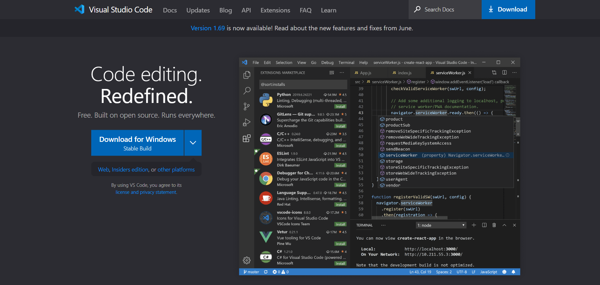
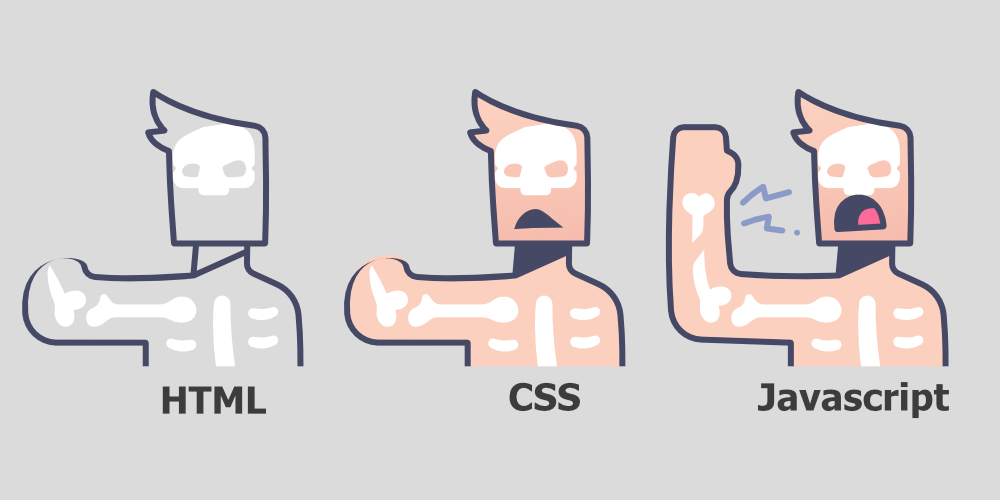
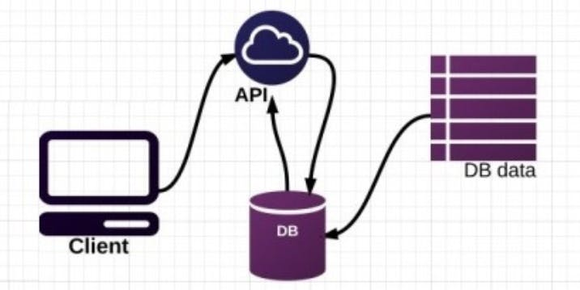

In this blog, I share with you a brief roadmap on how you can start to code and build your website online. To start writing code, you first need to have a code editor. The most popular choice for the code editor among developers is the VScode editor. You can download the VScode editor from their [official website](https://code.visualstudio.com).



To get started, you first need to understand the basic languages e.g. HTML, CSS, and Javascript. HTML is a markup language, CSS is used to style HTML elements, and Javascript loads dynamic content. You can understand it better by looking at the image below, where the skeleton of the body is described as HTML, the outer skin is described as CSS and his action as Javascript.



If you want to learn more about the basic languages, you can follow the below link

- [Get started with Javascript](https://taimoorsattar.com/blogs/javascript)
- [Get started with CSS](https://taimoorsattar.com/blogs/learn-css)

A client-side language such as HTML, CSS, or Javascript is responsible for displaying content on a browser (front-end). If we want to perform server-side tasks like a filesystem and connect with the database; then we need to learn server-side languages e.g. nodejs, and PHP. You have the option to choose between different server-side languages. If you are a WordPress lover, then PHP is the way to go. If you want to write Javascript on the server, then Nodejs is the option.

As mentioned, Javascript is used to load dynamic content (UI) without refreshing the page e.g. validating user input, popup modal/ads, toggling dark and light mode, etc. But if the UI of the website becomes more complex, then handling it with Javascript could be a very lengthy task. So, we need a more robust UI library, Reactjs. React is the JavaScript library for building user interfaces and is the most popular among developers. It helps you manage a lot of things easier with features like Virtual DOM(normal DOM updates are slow), handling data with states, component-based structure, etc.

Along with ReactJS, we need a framework that makes our development workflow smoother e.g. Page route, SSR, SSG, code automation, image optimization, etc. The most popular React frameworks are Gatsbyjs and Nextjs. As I'm more inclined towards Gatsbyjs, here I'll discuss the Gatsbyjs framework. Gatsby is a modern web framework built on top of React and GraphQL. We can use Gatsbyjs to build both static and dynamic sites. To get started with Gatsbyjs, you can choose [Gatsby starter template](https://github.com/taimoorsattar7/gatsby-starter-template). In the Gatsby project, any `**.js` file located in the `src/pages` folder serves as a page route. To start running the Gatsby project, we can execute the below command in the terminal.

```shell
npm run develop
```

After, Your site is now running at `http://localhost:8000`

We also need a backend server in Gatsbyjs to perform backend tasks. Luckily, in Gatsby, we can write serverless functions without running servers. To create a serverless function, we can create a `**.js` file at the `src/api` location in the project. In the frontend, we can execute the serverless function by sending HTTP requests to the respective API route.

For example, the `newsletter.js` file located at `src/api` create the API route at `http://localhost:8000/api/newsletter`. So to execute the respective function from the frontend, we can send the HTTP response to the respective API route as in the below code:

```js
import axios from "axios"

async function onSubmit(data: { name, email }) {
 let subscribe = await axios.post(`/api/newsletter`, {
 name: String(data.name),
 email: String(data.email),
  });

 if (subscribe?.data?.message === "success") {
 console.log("Great!!!");
  }
}
```

To store the user's data we need a database. There are many options to choose between the database e.g SQL or non-SQL. To interact with the database, we need a server e.g. nodejs. But, some of the database companies allow the developer to perform CRUD (create, read, update, and delete) operations on the database using the **API**. So, we can add an extra API layer to the database. Instead of interacting with the database, we can send the HTTP requests to the API route to retrieve or mutate the data. In this way, we can perform CRUD operations on both clients (frontend) and server sides.



For example, Sanity_io is the unified content platform. To mutate and retrieve the data from the Sanity server, we can send the HTTP request to the respective API route along with the query parameter.

To deploy your website, you need to have a public domain and a host server. If you don't have a public domain, don't worry you can host your website on the subdomain of the host server. The most popular hosting website are listed below.

- Netlify
- GitHub Pages
- Heroku
- Vercel
- Render
- Surge
- Firebase

Depending on the hosting website, you might have many options to build and deploy your website. But, the approach that we can follow is to push your code on Github (ship your code) and then deploy it on the netlify server as shown below


You can learn how to deploy your website on netlify by visiting [this page](https://taimoorsattar.com/modules/build-a-standout-website/hosting-on-netlify).

## Final Words

You have a brief understanding of how you can learn to code. To start off, practice some code online and get your hands dirty with the project. Some of the projects that you start doing right now are listed below

- Build a responsive website with HTML, CSS, and Javascript
- Build a todo list with React Project
- Store user's details in the database.

If you want an in-depth course, You can follow the link to learn more on [how to build a website using Gatsby js](https://taimoorsattar.com/p/build-standout-website).