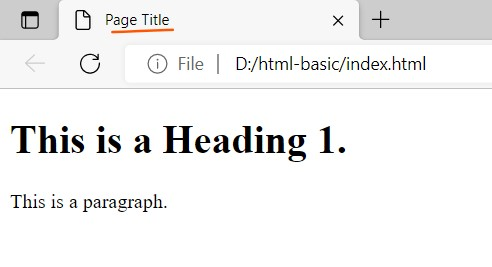
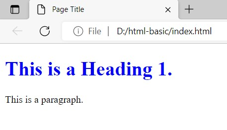
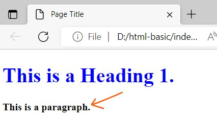
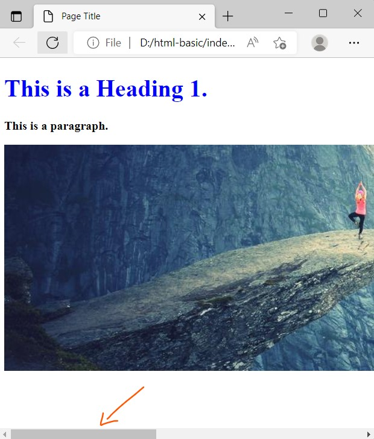
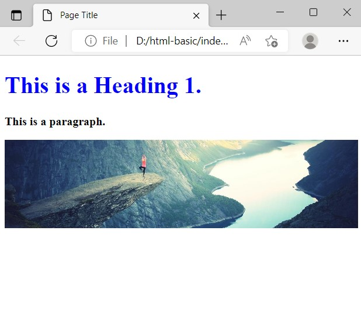
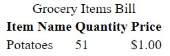
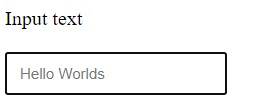

Html stands for hypertext markup language. It is used to define the foundation, skeleton and structure of the website e.g. text, images and videos.

## Get started

To Get started, we can create a `index.html` file. Inside of `index.html`, we can paste the below basic template for HTML template code.

```html
<!DOCTYPE html>
<html>
  <head>
    <title>Page Title</title>
  </head>
  <body>
    <h1>This is a Heading 1.</h1>
    <p>This is a paragraph.</p>
  </body>
</html>
```

Open the `index.html` file in the browser by double clicking or drag/drop the file in the browser. The above code render in the browser as below.



In the HTML, the text/content is wrap within the HTML "elements". HTML markup includes "elements" such as `<head>`, `<title>`, `<body>`, `<header>`, `<footer>`, `<article>`, `<section>`, `<p>`, `<div>`, `<span>`, ``, `<aside>`, `<canvas>`, `<nav>`, `<video>`, `<ul>`, `<ol>`, `<li>` and many others.

You can check for HTML element at the [this page](https://developer.mozilla.org/en-US/docs/Web/HTML/Element).

## Style HTML elements

Previously, We use HTML to display the text on the browser with no styling applied. To add the styling to the text, we can create a file `style.css` at the root. To link the `style.css` file to the html, we can write the below line of code in the `<head>` of the html.

```html
<head>
  <link rel="stylesheet" type="text/css" href="./style.css" />
</head>
```

In the `style.css`, we can write the code as below:

```css
h1{
  color: blue;
}
```

Refresh the browser page, the below HTML is displayed in the browser.



In CSS, we've different types of selector. Using CSS selectors, a set of CSS rules can be applied to certain elements. Few CSS selector are mentioned below:

- Universal selector e.g. `*`
- id selector e.g. `id="image"`
- class selector e.g. `class="image"`
- element selector e.g. `<h1>`, `<p>`, `` 
- attribute selector e.g. `a[target="_blank"]`, `input[type="text"]`

You can learn more about CSS selectors at [this page](https://developer.mozilla.org/en-US/docs/Web/CSS/CSS_Selectors).

To explain about class selector, we can update the HTML code as below:

```html
<p class="text-bold">This is a paragraph.</p>
```

In the `style.css`, we can write the CSS code as below to bold the paragraph text.

```css
.text-bold{
  font-weight: bold;
}
```

Refresh the browser, the below HTML is displayed in the browser.



## Images in HTML

In HTML, We can use the images (`` element) to display the visuals on the browser. To define the images, we can write the below code in HTML.

```html

```

If you want to download example images, you can visit [this page](https://picsum.photos).

The above code display in the browser as below:



In the above, the image width is larger than the browser width. We can adjust the image width in CSS as below:

```css
#image{
    width: 100%;
}
```

In the above CSS code, we use the id selector to style the `` element. Now, refresh the browser, the below HTML is displayed:



## Table in HTML

In HTML, We can structure content in columns and rows using the `<table>` element. To define the table in HTML, we can write the code as below:

```html
<table>
      <caption>
        Grocery Items Bill
      </caption>
      <thead>
        <colgroup>
          <col/>
          <col/>
          <col/>
        </colgroup>
        <tr>
          <th>Item Name</th>
          <th>Quantity</th>
          <th>Price</th>
        </tr>
      </thead>
      <tbody>
        <tr>
          <td>Potatoes</td>
          <td>51</td>
          <td>$1.00</td>
        </tr>
        
      </tbody>
    </table>
```

The above code displays in the browser as below



## Input forms

We can also use HTML to take input from the user. To define the input, we can write the below code:

```html
<form>
  <label>Input text</label> <br />
  <input  
    type="text"
    id="fullname"
    name="fullname"
    placeholder="Hello Worlds" />
</form>
```

The above HTML code displays in the browser as below.



## Resourses

- [How To Create Responsive Image](https://taimoorsattar.com/blogs/responsive-image)
- [https://taimoorsattar.com/blogs/image-slider-using-html-css](https://taimoorsattar.com/blogs/image-slider-using-html-css)
- [How To Structure Data In HTML Table](https://taimoorsattar.com/blogs/table-on-webpage)
- [How To Create An HTML Form](https://taimoorsattar.com/blogs/create-html-form)
- [How To Format Input Text While Typing Using Javascript](https://taimoorsattar.com/blogs/format-input-text-while-typing-javascript)
- [https://taimoorsattar.com/blogs/html-link](https://taimoorsattar.com/blogs/html-link)
- [Guide To The HTML Custom Data Attributes](https://taimoorsattar.com/blogs/guide-to-the-customs-data-attributes)
- [Disabled Property In HTML, CSS, And Javascript](https://taimoorsattar.com/blogs/disabled-property-in-html-css-and-javascript)
