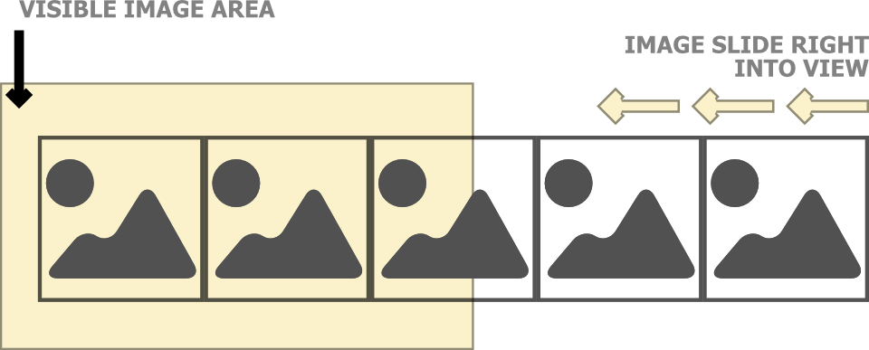

In this section, we learn how to create image slider using HTML and CSS. You can view the full source code at the below link.

https://codepen.io/taimoorsattar/pen/yLJBdKO

👆👆👆

To get started, we can structure Html code as shown below:

```html
<div class="wrapper">
  <h2>Image Slider</h2>
  <div class="slider">
    

    

    . .
    <!-- More Images Here. -->
    . .
  </div>
</div>
<!-- wrapper -->
```

You can add as many image as you like. To download dummy images, you can visit [picsum.photos](https://picsum.photos) site.

In the above HTML, we have define the class names to the HTML elements that is structure as below.

```text
.wrapper
  └── .slider
      └── 
      └── 
      └── .......
```

We can insert as many image as we like. We can can only see those images that are visible to us. As describe in the below image, yellow area is the visible area where image are shown. The image slider left to reveal more images.



Next, we need to define the width and height of the visible area as shown above. To define the width of visible area, we can define the `.wrapper` class as below.

```css
.wrapper {
  margin: auto;
  max-width: 960px;
}
```

In order to allow more images to be revealed, the visible area should scroll. For that, we can define the `.slider` class as below.

```css
.slider {
  overflow-x: scroll;
  white-space: nowrap;
}
```

Next, to make the scroll bar of slider more fancy, we can write the below code in CSS.

```css
::-webkit-scrollbar {
  height: 5px;
  width: 10px;
  border-radius: 5px;
}

/* Track */
::-webkit-scrollbar-track {
  background: #f1f1f1;
  border-radius: 5px;
}

/* Handle */
::-webkit-scrollbar-thumb {
  background: #888;
  border-radius: 5px;
}

/* Handle on hover */
::-webkit-scrollbar-thumb:hover {
  background: #555;
}
```

Also, I've wrote a blog about CSS scrollbar if you're interested to learn, visit the below link.

- [CSS scrollbar](https://taimoorsattar.dev/blogs/custom-scrollbar-in-css)

Finally, our image slider preview as below.


