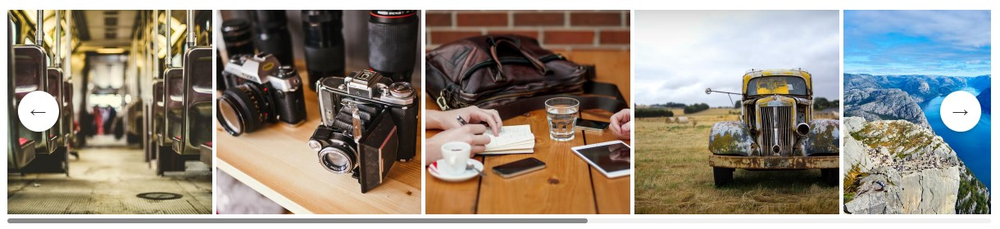

In this section, we learn how to create an image slider using javascript. We are adding functionality to [this image slider](https://taimoorsattar.com/blogs/image-slider-using-html-css) by adding a left/right arrow to slide the image in the respective direction.  

You can preview the image slider (Javascript) code for this section at the below codepen link:

- https://codepen.io/taimoorsattar/pen/oNqygmL

To get started, we can write the below code in HTML.

```html
<div class="wrapper">
 <h2>Image Slider (Javascript)</h2>
 <div class="slider">
 

 
 
 <!-- ++ more Images Here  -->
 
</div>
  <span class="flex items-center justify-center control-slider btn-left">
  <b>←</b>
  </span>
  <span class="flex items-center justify-center control-slider btn-right">
  <b>→</b>
  </span>
</div>
```

To add styling to the HTML, we can write the below code in CSS.

```css
.wrapper{
 margin: auto;
 max-width: 960px;
 position: relative;
}

.slider{
 width: 100%;
 
 transition: all 0.5s linear;
 overflow-x:scroll;     
 white-space: nowrap;
}

.slider img{
 display: inline-block;
 height: 200px
}
```

For the left/right arrow, we can use [CSS position](https://taimoorsattar.com/blogs/css-position-relative-absolute) to place the arrow at the respective position.

```css
.control-slider {
 cursor: pointer;
 position: absolute;
 z-index: 5;
 top: 50%;
 border-radius: 50%;
 height: 40px;
 width: 40px;
 background-color: #fff;
 line-height: 40px;
 color: #333;
 box-shadow: 0 2px 5px rgba(0, 0, 0, 0.25);
 user-select: none;
}

.btn-left {
 text-align: center;
 left: 10px;
}

.btn-right {
 text-align: center;
 right: 10px;
}
```

To [customize the scrollbar](https://taimoorsattar.com/blogs/custom-scrollbar-in-css) of image slider, we can write the below code in CSS

```css
::-webkit-scrollbar {
 height: 5px;
 width: 10px;
 border-radius: 5px;
}

/* Track */
::-webkit-scrollbar-track {
 background: #f1f1f1;
 border-radius: 5px;
}

/* Handle */
::-webkit-scrollbar-thumb {
 background: #888;
 border-radius: 5px;
}

/* Handle on hover */
::-webkit-scrollbar-thumb:hover {
 background: #555;
}
```

The image slider preview in the browser as below: 



In Javascript, we can add functionality when the left/right arrow is clicked the images slide in the respective direction. We can query the arrow element from the [dom using Javascript](https://taimoorsattar.com/blogs/manipulate-the-dom-using-javascript).

In Javascript, we can write the below code:

```js
const sliderElm = document.querySelector(".slider");

const btnLeft = document.querySelector(".btn-left");
const btnRight = document.querySelector(".btn-right");

const numberSliderBoxs = sliderElm.children.length;
const widthSliderBoxs = sliderElm.children[0].clientWidth
let totalsize = numberSliderBoxs * widthSliderBoxs;

function moveLeft() {
  sliderElm.scrollBy({
 top: 0,
 left: -widthSliderBoxs,
 behavior : "smooth"
  })
}

function moveRight() {
  sliderElm.scrollBy({
 top: 0,
 left: widthSliderBoxs,
 behavior : "smooth"
  })
}

// Event Listeners:
btnLeft.addEventListener("click", moveLeft);
btnRight.addEventListener("click", moveRight);
```

In the above code, we add an event listener to the arrow element so that when clicked, we execute the `moveLeft()` and `moveRight()` function to slide the images in the respective direction.

Finally, the image slider code preview in the browser is as below.


