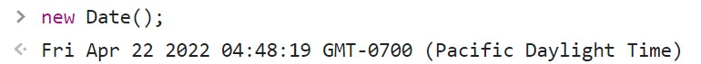
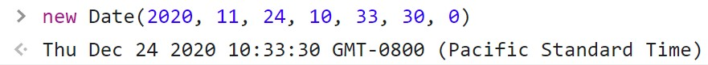
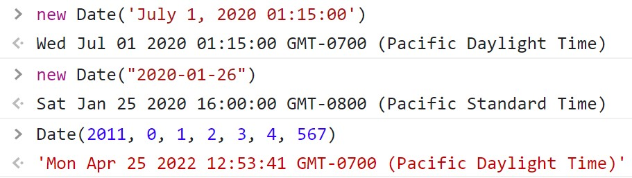
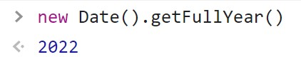
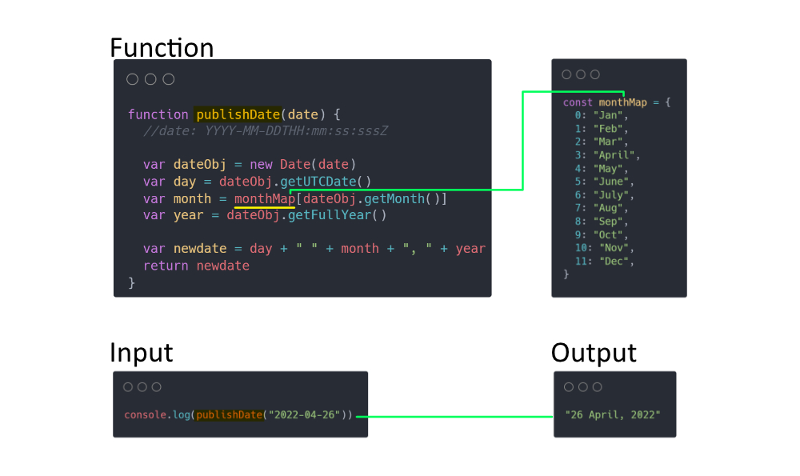
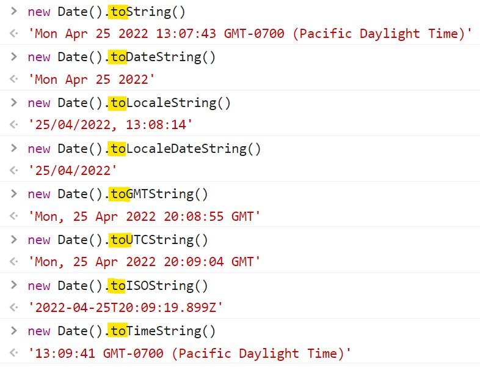
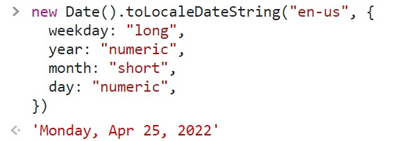
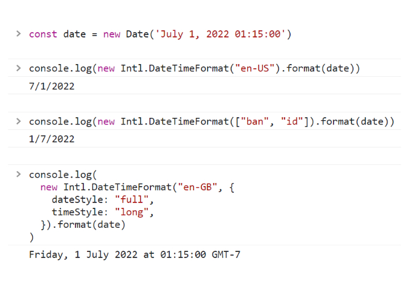

Javascript has a built-in object called `Date`. `Date` object in Javascript is used to work with Date and Time. In Javascript, we use the below command to get the current date.

```js
new Date() // shows current date/time
```

The output of the above code is: `Fri Apr 22 2022 04:48:19 GMT-0700 (Pacific Daylight Time)`. Date and Time output may vary depending on your time of execution of the command as shown in the below image.



You can output a custom date by specifying the year, month, day, hour, minute, second, and millisecond (in sequence) as shown in the below code.

```js
new Date(2020, 11, 24, 10, 33, 30, 0)
```

The above code returns as follows: `Thu Dec 24 2020 10:33:30 GMT+0300 (Arabian Standard Time)` as shown in the below image.



By entering a value into the date object Javascript, the correct date will be displayed as shown below.



- `new Date('July 1, 2020 01:15:00')`
- `new Date("2020-01-26")` // pattern: YYYY-MM-DDTHH:mm:ss:sssZ
- `Date(2011, 0, 1, 2, 3, 4, 567)`

Date objects in Javascript have Getter and setter methods as explained below:

- Getter Methods: Function used to `get` the date-specific values.
- Setters Methods: Function used to `set` the date-specific values.

For example, If we only want to get the year from the Date object, we can write the code as below.



The following are Javascript getter functions.

| Getter Function   | Description                                       |
| :---------------- | :------------------------------------------------ |
| getFullYear()     | Get the year as a four digit number (yyyy)        |
| getMonth()        | Get the month as a number (0-11)                  |
| getDate()         | Get the day as a number (1-31)                    |
| getHours()        | Get the hour (0-23)                               |
| getMinutes()      | Get the minute (0-59)                             |
| getSeconds()      | Get the second (0-59)                             |
| getMilliseconds() | Get the millisecond (0-999)                       |
| getTime()         | Get the time (milliseconds since January 1, 1970) |
| getDay()          | Get the weekday as a number (0-6)                 |

The following are the Setter functions of Javascript.

| Setter Function   | Description                                       |
| :---------------- | :------------------------------------------------ |
| setDate()         | Set the day as a number (1-31)                    |
| setFullYear()     | Set the year (month and day)                      |
| setHours()        | Set the hour (0-23)                               |
| setMilliseconds() | Set the milliseconds (0-999)                      |
| setMinutes()      | Set the minutes (0-59)                            |
| setMonth()        | Set the month (0-11)                              |
| setSeconds()      | Set the seconds (0-59)                            |
| setTime()         | Set the time (milliseconds since January 1, 1970) |

Let's work on an example to format the date using the above Javascript date methods.

Let's say we want to format the date `"2022-04-26"` into `"26 April, 2022"`. As we can see, there is no getter function that returns the month in the `alphabet`. So we can map the `numeric digits` to `alphabets` as shown below. We can also use a logic statement to achieve a similar result.

```js
const monthMap = {
  0: "Jan",
  1: "Feb",
  2: "Mar",
  3: "April",
  4: "May",
  5: "June",
  6: "July",
  7: "Aug",
  8: "Sep",
  9: "Oct",
  10: "Nov",
  11: "Dec",
}
```

Next, we write a function to format the date. The function accepts the parameter for the publish date of the blog that is not well formated. The function parameter should follow the date pattern as below.

```js
function publishDate(date) {
  //date: YYYY-MM-DDTHH:mm:ss:sssZ

  var dateObj = new Date(date)
  var day = dateObj.getUTCDate()
  var month = monthMap[dateObj.getMonth()]
  var year = dateObj.getFullYear()

  var newdate = day + " " + month + ", " + year
  return newdate
}
```



The above function will return the date as per our formatting like `Mar 4,2020`. It looks nice and clean to the reader when displayed it on the blog post, page, etc.

---

Furthermore, the Javascript Date object has built-in methods to format the date as shown below.



- `new Date().toString()`: 'Mon Apr 25 2022 13:07:43 GMT-0700 (Pacific Daylight Time)'
- `new Date().toDateString()`: 'Mon Apr 25 2022'
- `new Date().toLocaleString()`: '25/04/2022, 13:08:14'
- `new Date().toLocaleDateString()`: '25/04/2022'
- `new Date().toGMTString()`: 'Mon, 25 Apr 2022 20:08:55 GMT'
- `new Date().toUTCString()`: 'Mon, 25 Apr 2022 20:09:04 GMT'
- `new Date().toISOString()`: '2022-04-25T20:09:19.899Z'
- `new Date().toTimeString()`: '13:09:41 GMT-0700 (Pacific Daylight Time)'

We can customize the `toLocaleDateString()` method of Javascript Date object to get our desired date formating as shown below



```js
new Date().toLocaleDateString("en-us", {
  weekday: "long",
  year: "numeric",
  month: "short",
  day: "numeric",
})
```

---

Another option to format the date in Javascript is using `Intl.DateTimeFormat` which enables language-sensitive date and time formatting as shown below.



```js
const date = new Date("July 1, 2022 01:15:00")

console.log(new Intl.DateTimeFormat("en-US").format(date))
// Output: 7/1/2022

console.log(new Intl.DateTimeFormat(["ban", "id"]).format(date))
// Output: 1/7/2022

console.log(
  new Intl.DateTimeFormat("en-GB", {
    dateStyle: "full",
    timeStyle: "long",
  }).format(date)
)
// Output: Friday, 1 July 2022 at 01:15:00 GMT-7
```

---

If you are looking for a JavaScript date utility library, [date-fns](https://date-fns.org) is a simple and consistent toolset for manipulating JavaScript dates in a browser & Node.js.
