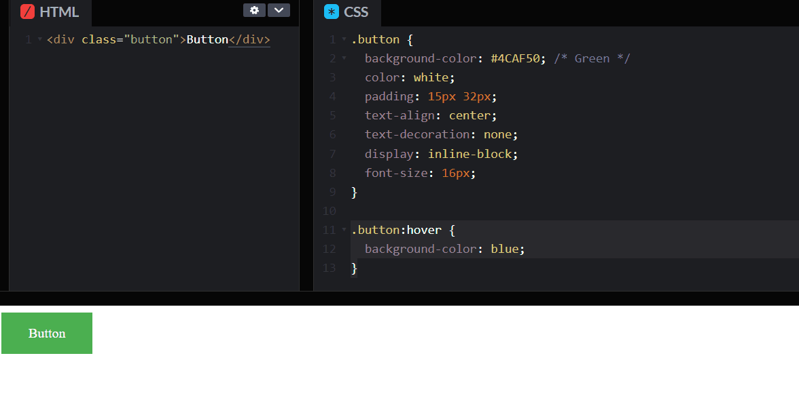
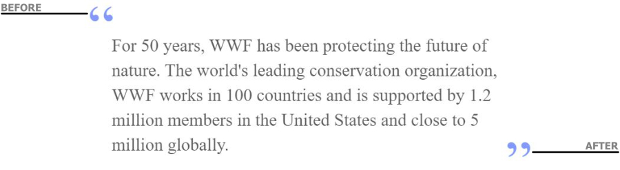

A pseudo-class is used to define (or style) special state of an HTML elements. They are useful in a variety of situations. e.g.

- Change the button background color on mouse hover
- Highlight link as visited and unvisited
- To highlight background color when input element get focus

The syntax of pseudo-class is as follows:

```css
selector:pseudo-class {
  property: value;
}
```

For example, in the below code when the Button is hovered, the background color of the button changes.



There are two types of Pseudo selector as follows

- Pseudo-class
- Pseudo-element

In the **Pseudo-class**, the state of an HTML element changed based on user interaction like button hover. In short, the HTML element is visible in the DOM. We use single column `:` symbol in pseudo class. Some of the example are as below:

- `:first-child`
- `:last-child`
- `:first-of-type`
- `:last-of-type`
- `:nth-child(2)`
- `:not(:hover)`

In **pseudo-elements**, we can create items that may not otherwise exist in the document tree. A pseudo-element is made of two colons (::) followed by the name of the pseudo-element. Some of the example of pseudo elements selector are as below:

- `:focus-within`
- `::selection`
- `::-webkit-scrollbar`
- `::placeholder`

Let's explain the pseudo css with examples.

## Disable a Submit Button

We use buttons to allow user to submit the [HTML form](https://taimoorsattar.dev/blogs/create-html-form). For example, the user hit a submit button in the HTML form. After that, the submission process takes few seconds to complete; meanwhile button should be disabled to avoid any further user interact. After the submission process has completed the button return to active state. In such case, we can use `:hover` and `:disabled` Pseudo-classes to define the state of button.

- `:hover` describe when the user hover over the buttom.
- `:disabled` selector does not allow button to respond on user click.

You can find the example code at codepen. Link below.

https://codepen.io/taimoorsattar/pen/WNxoLWX

👆👆👆

In the HTML tab, paste the below code.

```html
<!-- Active Button -->
<button class="btn" type="button">
  <span> Active </span>
</button>
```

```html
<!-- Disable button -->
<button class="btn" type="button" disabled>
  <span> Disable </span>
</button>
```

The `disabled` attribute disable user interaction with the button. We need to look for `disabled` attribute in CSS and apply certain styling.

In the CSS, paste the below code for general styling of buttons

```css
/* General Styling */
.btn {
  display: block;
  margin-bottom: 20px;
  padding: 0;
  outline: none;
  border: none;
}

span,
div,
a {
  font-size: 1.2rem;
  color: white;
  display: inline-block;
  background-color: black;
  border-radius: 4px;

  padding: 5px 25px;
  margin: 0;
}
```

Use the pseudo in CSS, we need to apply styling based on user interaction.

```css
button:hover {
  cursor: pointer;
  filter: brightness(0.8);
}
```

```css
button:disabled {
  cursor: not-allowed;
  opacity: 0.5;
  box-shadow: none;
  background-color: white;
}
```

## Blockquote in HTML and CSS

Blockquote is used to quote some text from another source. In this example, we will work on styling of blockquote using pseudo selector.

You can view full blockquote example code at codepen. Link below

https://codepen.io/taimoorsattar/pen/NWrbGKV

👆👆👆

In the HTML, paste the below HTML code.

```html
<blockquote cite="http://www.worldwildlife.org/who/index.html">
  For 50 years, WWF has been protecting the future of nature. The world's
  leading conservation organization, WWF works in 100 countries and is supported
  by 1.2 million members in the United States and close to 5 million globally.
</blockquote>
```

The above HTML code, display simple text on the screen.

To add styling to blockquote, let's divide it into three (3) parts.

- Text box
- starting inverted comma
- ending inverted comma

To add comma at the start and the end of text, we use below pseudo selector:

- `:before`
- `:after`

In CSS, we define the border-box for the elements of HTML so that the **text box** will shrink as define width. `border-box` tells the browser to account for any **border** and **padding** in the values you specify for an element's width and height.

For Example, If the element has the width of 500px, then change in the padding and margin will not effect the width of of the box. We can define the `border-box` in CSS as below.

```css
* {
  box-sizing: border-box;
}
```

To style the **text box in blockquote**, we use the below CSS code as below:

```css
blockquote {
  font-size: 1.5rem; /* Define font-size */
  max-width: 600px;
  line-height: 1.4;

  position: relative;
  color: #5d5d5d;
  margin: 15px auto;

  /* Define padding gap in the text */
  padding-top: 3rem;
  padding-bottom: 3rem;
  padding-left: 2rem;
  padding-right: 2rem;
}
```

```css
blockquote:before,
  blockquote:after {
    display: block;
    position: absolute;
    color: #8399fc;
    font-size: 5rem;
    letter-spacing: 0;
    line-height: 1;
    vertical-align: text-bottom:
  }

blockquote:before {
    content: "“";
    left: 0;
    top: 0;
  }

blockquote:after {
    content: "”";
    right: 0;
    bottom: 0;
  }
```


