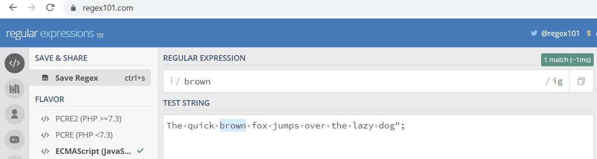

Regular expressions (Regex) are patterns used to match set of strings. Below mentioned are some of the use case of Regex.

- Find and Replace words in a text editor
- Validate user input
- Extract words from the paragraph

To practice regex, you can use the [regex101](https://regex101.com) tool.

## Basics of Regex

To define a regex, we've to define two things

- Pattern String
- Global pattern flags after the `/` symbol.

To demonstract how to write regex expression, let's consider an example.

```javascript
let sentence = "How does it work? It works by pushing the button."
```

In the above sentence, the letter `work` comes two time with singular and plural ('s').

We can define the pattern using regex to find letter `work` in the sentence define

```javascript
let searchLetter = /words?/gi
```

In the above regex pattern, we have 's' letter option.

Now, We've define regex pattern. *So how we can use it?*

We can use the regex pattern with the method of RegExp and Strings.

- `exec()`: RegExp method
- `test()`: RegExp method
- `match()`: Strings method
- `matchAll()`: Strings method
- `replace()`: Strings method
- `replaceAll()`: Strings method
- `search()`: Strings method
- `split()`: Strings method

So, we can replace the letter 'work' with the letter 'run' using `replace()` string method.

```javascript
const updatedStory = story.replace(myNameSearch, 'Samuel')
```


To include special character, we need to first escape it using backsplash.

[cyr]: indicate one character or digit contains letter enclosed in the bracket
[cyr]{3}: Check for match three times in a row
[cyr]{1,3}: Minimum of 1 time and maximum of 3 time. Check for match three times in a row
[cyr]{1,} | [cyr]+: Minimum of 1 time and maximum of 3 time. Check for match three times in a row
([cyr]{1,}): Round bracket shows capturing group.


g global we are looking for every instance in the text.
i case-insensitive
h? may occur 0 or 1 time
[a-z]{6} allow character from a to z up to six sharacter
[a-z]{6}: allow all character from a to z whenever colon (:) occure
\s: space
/^ sdasdsa$/ Defines the begining and end of the line.
\d digit from 0 to 9

\s whitespace character.

const story = "There are a lot of phone numbers. One is 5555555555, and another is 123-123-1234. Yet another is 321.321.4321. Another is 555 555 5555. Did you know another phone number is 1 555 555 5555 and my friend has a number of (555) 123 1234. My other friend has a number of 555 555-5555 and another has 1.987.654.3210."

const phonePattern = /1?[-.\s]?\(?(\d{3})\)?[-.\s]?(\d{3})[-.\s]?(\d{4})/g

[0-9] \d
\w alpha numeric character


|Sr# | Modifier | Description |
|:--- |:---- |:----:|
|1.| g | global: All matches (don't return after first match) |
|2.| i | case-insensitive |
|3.| U | Ungreedy: The match becomes lazy by default. Now a ? following a quantifier makes it greedy |
|3.| m | multi line: Causes ^ and $ to match the begin/end of each line (not only begin/end of string) |


^
 
x modifier: extended. Spaces and text after a # in the pattern are ignored
s modifier: single line. Dot matches newline characters
u modifier: unicode. Pattern strings are treated as UTF-16. Also causes escape sequences to match unicode characters
A modifier: Anchored. The pattern is forced to become anchored at the start of the search, or at the position of the last successful match, equivalent to a \G
J modifier: Allow duplicate subpattern names
D modifier: Dollar. Force the a dollar sign, $, to always match end of the string, instead of end of the line. This option is ignored if the m-flag is set


## Regex with examples?

To understand more about reqex, let's cover examples. The below examples demonstrate our use of regex:

1. Find and Replace
2. Find and arrange
3. Validate a user input

---

### Find and Replace (regex)

In the first example, we need to first find the word in the sentence. After, we need to replace that word in the sentence.

For example, we have following example: 

```
The quick brown fox jumps over the lazy dog.
```

So, using regex, we've to find letter `dog`.

```javascript
let string = "The quick brown fox jumps over the lazy dog";
let regex = /dog/ig;
```



We can update the sentence to replace the letter `dog` with letter `fox`. In JavaScript, we can write as below:

```javascript
let updatedString = string.replace(regex, "fox");
console.log(updatedString);
```

---

### Find and arrange (regex)

Below we have listed out todo items in the javascript array. using regex, we need to display in presentable 

```javascript
const todos = [
  "monday: running, cycling",
  "tuesday: reading, writing",
  "wednesday: play hockey, travel"
];
```

In the above todo list is that we can have two (2) items.

In regex we can use **capturing groups** to capture the value in the : 

```javascript
const todoPattern = /([a-z\s]+):\s([a-z ,]+)/i
```

```javascript
const petsUpdated = pets.map(pet => pet.replace(petPattern, '$2 $2 <span class="description">$1</span>'))
```

### Validate a user input (regex)

We can validate user input using Regex in JavaScript. To validate input, we can write a regex pattern, and then perform a test command to verify if the input is valid or not.

For example, we can validate a username input by defining the regex pattern as below

```javascript
const usernamePattern = /^[a-z][a-z0-9]{7,29}$/i
```

The above usernamePattern (regex) reads as below:

- The first letter should be alphebhet (a-z)
- After the first letter, if can contain alephbets and numeric of max lenght of 29 and min length of 7.

To test the regex pattern for username, we can 

```javascript
if (usernamePattern.test(userInput)) {
  // success
}else{
  // fail
}
```