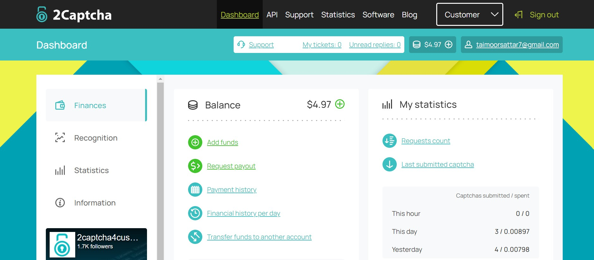
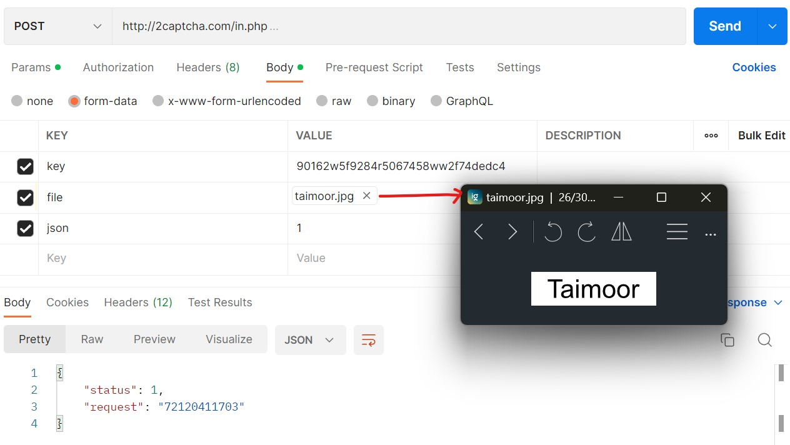
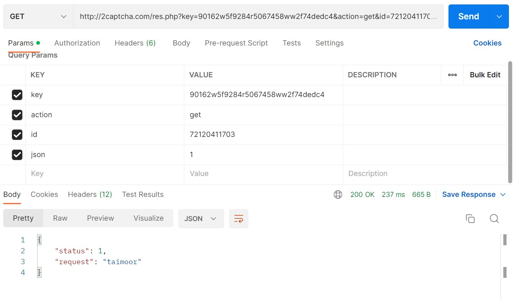
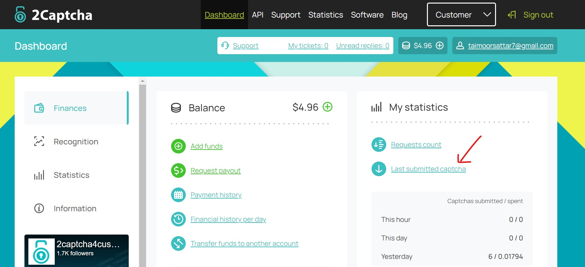
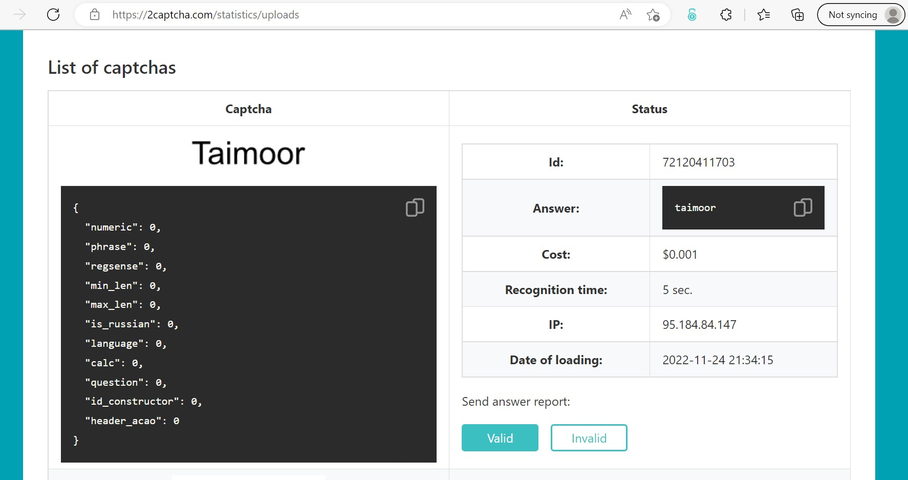

2Captcha is a CAPTCHA recognition service and is primarily used to solve CAPTCHAs in a quick and accurate manner. You can learn more about the 2Captcha service on [this website](https://2captcha.com).

To Get Started with 2Captcha, You can register into the account as "I'm a customer". After registration, You'll be navigated to the dashboard as shown below.

In the Dashboard, You can get access to the API Key that we'll use later to send the HTTP request to the 2Captcha service.

> To solve the captcha using 2captcha Service, You need to deposit some credits to the 2captcha account.

2Captcha Service provides an API endpoint that we can use to solve the CAPTCHAs. You can learn more about 2captcha API on [this page](https://2captcha.com/api-docs).

The two (2) important 2captcha API endpoints are described below

| API                           | Description                             |
| :---------------------------- | :-------------------------------------- |
| http://2captcha.com/in.php    | It is used to submit a captcha          |
| http://2captcha.com/res.php   | It is used to get the captcha solution  |

To test the 2Captcha API, we can use Postman to send the HTTP request. For that, we can send the HTTP request as below.

In response to the HTTP request, we received the request Id. We can use the request Id to query the result of the captcha. To get the response of the captcha, we can send the HTTP request from the Postman as below:

Also, You can also check for the last submitted captcha from the 2captcha dashboard. For that, navigate to the page as marked below.

From there, You can scroll down to the list of Captchas you have submitted.

As above, We've used the 2Captcha service to solve the simple Captcha image. Not only that, but 2Captcha also provide variety of captcha-solving service e.g. Normal Captcha, Text Captcha, reCAPTCHA, Capy Puzzle, etc.
